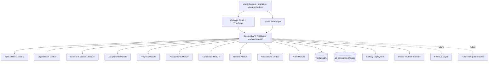

# 03. LMS Architecture Map

**Проект:** корпоративная LMS / Learning Operating System  
**Назначение документа:** описать архитектуру системы на уровне модулей, слоёв, хранилищ, frontend/backend-границ и будущего развития.  
**Архитектурный принцип:** modular monolith first, Railway-first, Docker-portable.

---

## 1. Главная архитектурная формула

```text
React + TypeScript frontend
        ↓
TypeScript backend modular monolith
        ↓
PostgreSQL + S3-compatible storage
        ↓
Railway-first deployment + Docker portability
        ↓
Future: mobile app, integrations, AI layer, analytics services
```

Главный принцип: начать с хорошо структурированного модульного монолита, а не с микросервисов.

---

## 2. Почему modular monolith first

### 2.1 Причины выбора

- проект разрабатывается одним человеком с AI-агентами;
- MVP должен быть быстрым и управляемым;
- корпоративная LMS имеет много связанных доменов;
- раннее разделение на микросервисы увеличит сложность;
- Railway-first deployment проще для монолита;
- Docker-portable подход сохраняет возможность переноса;
- модульные границы позволят выделить сервисы позже.

### 2.2 Что запрещено на старте

- создавать отдельный сервис для каждого домена;
- вводить event-driven архитектуру без необходимости;
- добавлять Kubernetes в MVP;
- создавать Julia/AI сервис до готовности core LMS;
- усложнять инфраструктуру раньше product-market validation.

---

## 3. High-level architecture



---

## 4. Repository architecture

Рекомендуемый монорепозиторий:

```text
lms-platform/
  apps/
    api/
      src/
        modules/
        shared/
        config/
        database/
        main.ts
    web/
      src/
        app/
        pages/
        features/
        entities/
        shared/
    mobile/
      README.md
      # future scope
  packages/
    shared-types/
    ui/
    config/
  infra/
    docker/
    railway/
  docs/
  scripts/
  .github/
    ISSUE_TEMPLATE/
    workflows/
```

### 4.1 Apps

- `apps/api` — backend API;
- `apps/web` — web interface;
- `apps/mobile` — future mobile app placeholder.

### 4.2 Packages

- `shared-types` — типы, DTO, enums;
- `ui` — общие UI-компоненты;
- `config` — общие настройки lint/tsconfig.

### 4.3 Infra

- Docker;
- Railway config;
- deployment docs;
- local development scripts.

---

## 5. Backend architecture

Backend должен быть TypeScript modular monolith.

### 5.1 Слои backend

```text
HTTP/API Layer
  ↓
Application Services
  ↓
Domain Modules
  ↓
Repositories / ORM
  ↓
PostgreSQL / S3
```

### 5.2 Backend modules

```text
modules/
  auth/
  users/
  roles-permissions/
  organizations/
  groups/
  courses/
  lessons/
  files/
  assignments/
  progress/
  assessments/
  certificates/
  reports/
  notifications/
  audit/
  settings/
```

---

## 6. Backend module responsibilities

### 6.1 Auth

Отвечает за:

- login/logout;
- password hashing;
- sessions/JWT;
- password reset;
- current user;
- auth guards.

### 6.2 Users

Отвечает за:

- создание пользователей;
- профили;
- статусы пользователей;
- связь с организацией;
- связь с ролями и группами.

### 6.3 Roles & Permissions

Отвечает за:

- роли Learner/Instructor/Manager/Admin;
- permission checks;
- route guards;
- backend authorization.

### 6.4 Organizations & Groups

Отвечает за:

- organizations;
- departments;
- groups;
- memberships;
- manager relationships;
- tenant-ready filtering.

### 6.5 Courses & Lessons

Отвечает за:

- courses;
- course lifecycle;
- modules/sections;
- lessons;
- publication;
- lesson ordering;
- content metadata.

### 6.6 Files

Отвечает за:

- upload metadata;
- S3-compatible storage;
- signed URLs;
- access control;
- file attachment to lessons.

### 6.7 Assignments

Отвечает за:

- course-to-user assignment;
- course-to-group assignment;
- enrollments;
- deadlines;
- assignment statuses.

### 6.8 Progress

Отвечает за:

- lesson progress;
- course progress;
- completion percentage;
- started/completed timestamps;
- progress recalculation.

### 6.9 Assessments

Отвечает за:

- tests;
- questions;
- answer options;
- attempts;
- scoring;
- pass/fail.

### 6.10 Certificates

Отвечает за:

- certificate templates;
- issued certificates;
- verification codes;
- certificate lifecycle;
- certificate download metadata.

### 6.11 Reports

Отвечает за:

- admin reports;
- manager reports;
- course reports;
- learner reports;
- export.

### 6.12 Notifications

Отвечает за:

- in-app notifications;
- assignment events;
- deadline reminders;
- completion events;
- future email notifications.

### 6.13 Audit

Отвечает за:

- critical events;
- actor/action/resource logs;
- admin audit screen;
- security traceability.

---

## 7. Frontend architecture

Frontend: React + TypeScript.

### 7.1 Главные интерфейсные зоны

```text
/learner
/admin
/instructor
/manager
/auth
```

### 7.2 Основные frontend features

```text
features/
  auth/
  users/
  groups/
  courses/
  course-player/
  assignments/
  progress/
  assessments/
  certificates/
  reports/
  notifications/
```

### 7.3 Основные экраны MVP

#### Auth

- login;
- password reset;
- current user loading.

#### Learner

- learner dashboard;
- assigned courses;
- course player;
- assessment screen;
- certificates.

#### Instructor

- my courses;
- course editor;
- lesson editor;
- assessment editor;
- course preview.

#### Manager

- team dashboard;
- team progress;
- overdue learners;
- assessment results.

#### Admin

- users;
- roles;
- groups;
- courses;
- assignments;
- reports;
- audit log;
- settings.

---

## 8. Database architecture

Основная база данных: PostgreSQL.

### 8.1 Основные группы таблиц

```text
identity:
  users
  roles
  permissions
  user_roles
  sessions

organization:
  organizations
  departments
  groups
  group_members
  manager_assignments

learning_content:
  courses
  course_modules
  lessons
  lesson_content_blocks
  files

learning_delivery:
  course_assignments
  enrollments
  lesson_progress
  course_progress

assessment:
  assessments
  questions
  answer_options
  assessment_attempts
  attempt_answers

certification:
  certificate_templates
  issued_certificates

communication:
  notifications

reporting_audit:
  audit_logs
  report_exports
```

### 8.2 Обязательные технические поля

Для основных бизнес-таблиц:

- `id`;
- `created_at`;
- `updated_at`;
- `created_by` where applicable;
- `updated_by` where applicable;
- `organization_id` where applicable;
- `deleted_at` where soft delete required;
- `status` where lifecycle exists.

### 8.3 Multi-tenancy approach

Для MVP рекомендуется tenant-ready модель:

- добавить `organization_id` в основные бизнес-сущности;
- фильтровать данные по organization context;
- не строить сложный enterprise multi-tenant слой до появления необходимости;
- заложить возможность усилить изоляцию позже.

---

## 9. Storage architecture

Файлы должны храниться в S3-compatible storage.

### 9.1 Что хранить в S3

- учебные материалы;
- изображения;
- документы;
- видео, если используются;
- сертификаты или их сгенерированные версии;
- импортируемые файлы;
- экспортируемые отчёты.

### 9.2 Что хранить в PostgreSQL

- metadata файлов;
- owner;
- organization_id;
- file type;
- storage key;
- size;
- access rules;
- relation to lesson/course/certificate.

---

## 10. API architecture

Основной подход: REST API для MVP.

### 10.1 API groups

```text
/api/auth
/api/users
/api/roles
/api/organizations
/api/groups
/api/courses
/api/lessons
/api/files
/api/assignments
/api/progress
/api/assessments
/api/certificates
/api/reports
/api/notifications
/api/audit
/api/settings
```

### 10.2 API standards

- JSON request/response;
- consistent error format;
- pagination for lists;
- filtering and sorting where needed;
- RBAC guard for protected endpoints;
- organization context filtering;
- validation on input DTOs;
- OpenAPI can be added after API stabilization.

### 10.3 Error format

```json
{
  "error": {
    "code": "COURSE_NOT_FOUND",
    "message": "Course not found",
    "details": {}
  }
}
```

---

## 11. Deployment architecture

### 11.1 Railway-first

MVP должен быть готов к первому деплою на Railway:

- backend service;
- frontend service or static deployment;
- PostgreSQL;
- environment variables;
- migration command;
- healthcheck;
- logs.

### 11.2 Docker-portable

Проект должен сохранять переносимость:

- Dockerfile for backend;
- Dockerfile for frontend if needed;
- docker-compose for local stack;
- PostgreSQL service;
- S3-compatible service for local development, e.g. MinIO;
- documented env vars.

---

## 12. Security architecture

### 12.1 MVP security baseline

- password hashing;
- secure sessions or JWT;
- RBAC on backend;
- route protection on frontend;
- organization-level data filtering;
- file access control;
- audit log for critical actions;
- rate limiting for auth endpoints;
- safe env var handling;
- no secrets in repository.

### 12.2 Future enterprise security

- SSO/SAML;
- advanced audit;
- IP restrictions;
- stronger tenant isolation;
- security policies;
- compliance exports;
- admin action approvals.

---

## 13. Mobile architecture

### 13.1 MVP mobile approach

For MVP:

- responsive learner web interface;
- mobile-friendly course player;
- simple navigation;
- touch-friendly UI;
- no offline-first requirement.

### 13.2 Future mobile app

Future app may include:

- learner dashboard;
- assigned courses;
- course player;
- progress sync;
- certificates;
- push notifications;
- offline content later.

Mobile app should consume the same API as web frontend.

---

## 14. Future AI architecture

AI is future scope, not MVP.

### 14.1 Future AI layer

Possible modules:

- AI Gateway;
- prompt templates;
- content generation;
- quiz generation;
- RAG over corporate materials;
- learning recommendations;
- analytics summaries.

### 14.2 Rule

AI functions must not be embedded chaotically into core LMS modules. They should be added as a separate layer after MVP stabilization.

---

## 15. Future service extraction map

Services may be extracted only when real triggers appear.

| Candidate Service | Extract Later When |
|---|---|
| File service | file processing becomes heavy |
| Notification service | email/push volume grows |
| Reports service | analytics queries affect core DB |
| AI service | AI workloads become production-critical |
| Integrations service | many external systems appear |
| Certificate service | certificate generation becomes complex |

---

## 16. Module boundary rules

### 16.1 General rules

- modules communicate through application services;
- avoid direct database access across module boundaries;
- shared types should be explicit;
- business logic should not live in controllers;
- frontend should not duplicate backend permission logic as source of truth;
- audit events should be emitted by critical operations.

### 16.2 Anti-overengineering rules

Do not add:

- microservices;
- distributed transactions;
- Kafka/RabbitMQ in MVP unless absolutely necessary;
- Kubernetes;
- complex CQRS/event sourcing;
- AI orchestration layer;
- polyglot runtime.

---

## 17. Architecture decision records to create later

Recommended ADRs:

1. `ADR-001 Modular Monolith First`
2. `ADR-002 Railway First Deployment`
3. `ADR-003 Docker Portability`
4. `ADR-004 PostgreSQL as Primary Database`
5. `ADR-005 S3-Compatible Storage`
6. `ADR-006 REST API for MVP`
7. `ADR-007 AI Functions as Future Scope`
8. `ADR-008 Tenant-Ready Organization Model`

---

## 18. MVP architecture success criteria

Architecture is successful if:

- one developer can understand and maintain it;
- AI coding agents can modify modules without breaking the whole project;
- core learning loop works end-to-end;
- backend modules are separated by responsibility;
- deployment to Railway is simple;
- Docker portability is preserved;
- database model supports future growth;
- AI/enterprise/mobile extensions are possible later without rewriting the MVP.

---

## 19. Next documents after Stage 1

This architecture map should be used to create:

1. `04_LMS_Database_Model_Draft.md`
2. `05_LMS_API_Contracts_Draft.md`
3. `06_LMS_Repository_Structure.md`
4. `07_LMS_Unified_Product_Backlog.md`
5. `08_LMS_GitHub_Issues_Import.md`
6. `10_LMS_AI_Coding_Agent_Instructions.md`

---

## 20. Итог

Архитектура проекта должна оставаться практичной. Главная задача — не построить идеальную enterprise-систему сразу, а создать устойчивый технический фундамент, который позволит быстро разработать MVP и затем расширять LMS без полной переделки.
